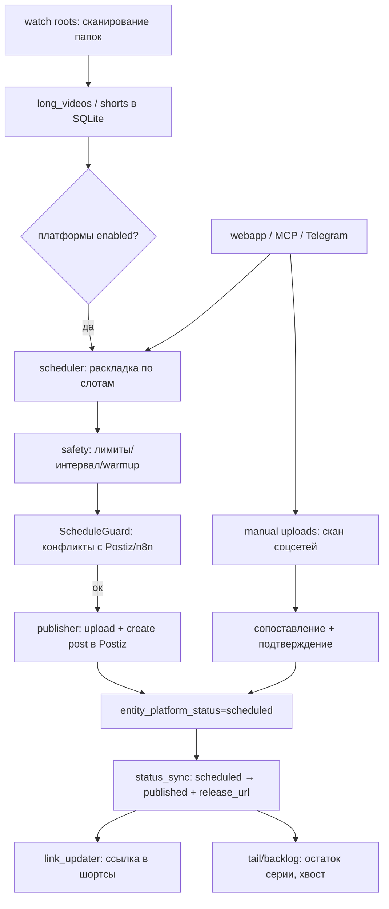

# HANDOFF — передача в следующую сессию

> Прочитай этот файл первым. Он даёт полную картину: что за система, что сделано,
> что осталось, где что лежит и как это эксплуатировать.

Дата: 2026-09-19. Версия кода: `7.3.1`, UI-сборка **b28**, тестов: **151**.

---

## 1. TL;DR (состояние на сейчас)

- Система **работает и задеплоена**. Все сервисы active, тесты зелёные, GitHub синхронизирован.
- Оркестратор (публикации VideoMaker/ShortsMaker → Postiz → соцсети) + веб-панель + Telegram + MCP.
- **YouTube подключён** (канал `testPostiz`, тестовый). Telegram — канал `Postiz Test Channel`.
- Остались задачи, требующие пользователя: боевой YouTube, папки с видео (`/Volumes/SSD/untitled folder`), стабильный домен, ротация секретов.

---

## 2. Что это за система

```
VideoMaker/ShortsMaker ──► Orchestrator (Python, systemd, pve) ──► Postiz (VM 120) ──► соцсети
      (папки с видео)          watcher→scheduler→publisher→sync        docker
                                        │
             ┌──────────────────────────┼───────────────────────────┐
             ▼                          ▼                           ▼
      SQLite (data.sqlite)      Telegram-бот (уведомления)     WebApp (панель, Telegram Mini App)
                                        │
                                        └──── MCP ──► ИИ (opencode/Claude) ──► engines (postiz/direct/n8n/browser)
```

### Граф действий (ключевые потоки)



---

## 3. Инфраструктура и доступы

| Что | Значение |
|---|---|
| PVE-хост | `ssh root@100.95.225.71` (tailscale) / `192.168.100.50` (LAN), hostname `pve` |
| VM Postiz | `192.168.100.60`, доступ через `ssh postiz@192.168.100.60` или `qm guest exec 120 -- ...` |
| Docker-стек | `postiz`, `postiz-nginx-https-1`, `postiz-db`, `postiz-redis`, `postiz-temporal`, `postiz-media` |
| Оркестратор | `/opt/orchestrator` на `pve`, пользователь `orchestrator` (systemd) |
| Compose Postiz | `/home/postiz/postiz/docker-compose.yml` (бэкапы `.bak.*`) |
| Postiz UI | https://192-168-100-60.sslip.io (nginx 443, самоподписанный) |
| Админ Postiz | `ko_geniy@mail.ru` / `00000000` |
| Webapp | cloudflared quick-tunnel, текущий URL в `/var/lib/cloudflared-webapp.url` |
| Репозиторий | `git@github.com:cryptoigor007/postiz-orchestrator.git` (private, ветка `master`) |
| Mac-путь | `/Users/dreamstore/Downloads/orchestrator` |

### Где лежат секреты (не в репозитории)
- `pve:/opt/orchestrator/.env` — `POSTIZ_API_TOKEN`, `WEBAPP_ACCESS_KEY`, `TELEGRAM_BOT_TOKEN`,
  `TOKEN_BROKER_SECRET`, `ORCH_BACKUP_MIRROR`, `TELEGRAM_MODE`.
- `VM:/etc/token-broker.env` — `BROKER_SECRET`, `BROKER_ALLOW_IPS`, `BROKER_PLATFORMS`.
- `VM:/home/postiz/postiz/docker-compose.yml` — пароли БД/Redis, `JWT_SECRET`,
  `YOUTUBE_CLIENT_ID/SECRET`.
- GitHub-доступ на Mac — в связке ключей (osxkeychain), remote HTTPS.

---

## 4. Что сделано (по сессиям, кратко)

### Исходная задача
Восстановить Postiz (self-hosted) и наладить панель/логику публикаций.

### Postiz
- Найден и исправлен **cookie domain** (`Domain=.sslip.io` → hostname без точки) и **nginx**:
  - `/api/` → backend со срезом префикса; `/auth/*` → фронтенд (страницы логина); `/public` → backend.
- Собран и задеплоен образ **`postiz-fixed:v1.47.0`** (фикс cookie + патчи), compose переведён на него.
- Подключён Telegram publisher-бот (`TELEGRAM_TOKEN`), канал `Postiz Test Channel`.
- Подключён YouTube (новый OAuth-клиент, канал `testPostiz`).

### Оркестратор (наш проект)
- Полный аудит и починка: `sync_updates`, календарь (слияние с Postiz), метрики, health.
- Веб-панель: разделы Статус/Папки/**Ручные**/Календарь/Очередь/Платформы/**Остаток**/Ошибки/Метрики/Действия/Справка,
  **RU/EN**, кэш-бастинг по путям сборки, полноэкранный режим, скрытая заглушка (CSS `[hidden]`).
- **Движки публикации** (`engines/`): `postiz`, `direct:youtube`, `n8n`, `browser (эксперим.)`;
  реестр возможностей и выбор движка в `config.engines`.
- **Ручные загрузки**: скан соцсетей → сопоставление (название/дата/длительность) →
  обязательное подтверждение → клеймы (ручная пометка + действия) → учёт в БД.
- **Остаток серии (backlog)**: вопрос за 60 мин до слота (15:00 для 16:00), кнопки
  «Распределить/Ждать/Не публиковать», напоминание за 15 мин, автодефолт к слоту;
  остаток **блокирует старт следующей серии**, пока не выложен.
- **Анти-коллизии расписаний**: `ScheduleGuard` сверяет слоты с Postiz (и n8n при `N8N_URL`),
  кэш 5 мин, окно настраивается (`safety.conflict_window_minutes`).
- **Платформенные папки**: `<серия>/youtube/final.mp4`, `<серия>/telegram/...`,
  `<серия>/shorts/short_01/youtube.mp4` (схема БД v10, поле `platform_paths`).
- **Токен-брокер** на VM: отдаёт OAuth-токен канала из Postiz, выбор канала по `id`,
  секрет + IP-allowlist (`192.168.100.50,127.0.0.1`).
- **Надёжность**: изоляция сбоев публикации, откат при неудачном пересоздании поста,
  авто-дефолт при пропущенном окне, ограниченный no-ack опрос Telegram (не крадёт `/connect`),
  джиттер не уводит в прошлое, зеркало бэкапов на другой диск.
- **Эксплуатация**: `scripts/check.sh` (ruff+compile+pytest), `scripts/deploy.sh` (безопасный
  rsync + chown + рестарт + синк кнопки), `infra-watchdog.timer` (панель/брокер/туннель → алерт),
  CI GitHub Actions (ruff+pytest).
- **MCP**: `scripts/mcp_server.py` (оркестратор, 27 инструментов), `scripts/postiz_mcp_server.py`
  (Postiz).

---

## 5. Команды (шпаргалка)

```bash
# локально (Mac)
cd /Users/dreamstore/Downloads/orchestrator
./scripts/check.sh                 # lint + compile + node + 151 тест
./scripts/deploy.sh                # безопасный деплой на pve + рестарт + синк кнопки

# на pve
ssh root@100.95.225.71
systemctl status orchestrator.service cloudflared-webapp.service cloudflared-url-sync.timer infra-watchdog.timer
journalctl -u orchestrator.service -f
curl -s http://127.0.0.1:8080/health
cat /var/lib/cloudflared-webapp.url

# на VM
systemctl status token-broker.service
docker ps
```

Проверка API панели (ключ — `WEBAPP_ACCESS_KEY` из `/opt/orchestrator/.env`):
```bash
curl -s "http://192.168.100.50:8080/webapp/api/status?key=<KEY>"
curl -s "http://192.168.100.50:8080/webapp/api/backlog?key=<KEY>"
```

---

## 6. Текущее состояние компонентов

- **Интеграции Postiz:** `telegram` → `Postiz Test Channel` (`cmu7g6kjq0001rw6wbwh46plb`),
  `youtube` → `testPostiz` (`cmu8el8yg0001nl7j89k74ht6`).
- **Конфиг** (`config.yaml`): `engines.youtube=direct`, `engines.telegram=postiz`;
  `platforms.youtube.integration_id=cmu8el8yg…`; `manual_uploads.schedule_scan=daily`;
  `tail.ask_minutes_before=60`, `default_action=distribute`; `safety.conflict_window_minutes=0`.
- **Watch roots:** сейчас одна папка (`/mnt/video/broll_downloads/Vertical/10_Precision_Cutting`).
- **Бэкапы:** `/opt/orchestrator/backups` + зеркало `/mnt/video/BACKUP_PVE/orchestrator`.
- **YouTube OAuth:** клиент `147375850159-mcarrb37r356s1aea6vlrf40bf83c7a2…`,
  consent в статусе Testing (аккаунт добавлен в Test users), redirect
  `https://192-168-100-60.sslip.io/integrations/social/youtube`.

---

## 7. Известные грабли и как чинить

| Симптом | Причина | Решение |
|---|---|---|
| `attempt to write a readonly database` | rsync от root сменил владельца | `chown -R orchestrator:orchestrator /opt/orchestrator`, деплой через `scripts/deploy.sh` |
| 502 на `/api/*` после пересоздания postiz | nginx держит старый IP контейнера | `docker restart postiz-nginx-https-1` (хелпер oauth уже делает сам) |
| Панель показывает заглушку | открыт старый/закэшированный URL | открыть свежую кнопку (build-путь меняется), меню обновляет `cloudflared-url-sync.timer` |
| `token broker: no token for ...` | канал не подключён в Postiz | подключить канал; при нескольких — указать `id` |
| `redirect_uri_mismatch` | URI не в OAuth-клиенте | добавить ровно `https://192-168-100-60.sslip.io/integrations/social/youtube` |
| `access_denied` (403) | аккаунт не в Test users | Google Auth Platform → Audience → Test users |
| `deleted_client` | OAuth-клиент удалён | создать новый и `bash /home/postiz/postiz/set_youtube_oauth.sh <id> <secret>` |
| Публикации нет, платформа «пауза» | случайная пауза из панели | раздел «Платформы» → «Возобновить» |
| Telegram не отвечает на команды | `TELEGRAM_MODE=off` | `TELEGRAM_MODE=poll` в `/opt/orchestrator/.env` + рестарт |

---

## 8. Что осталось (нужен пользователь)

1. **Боевой YouTube** — подключить реальный канал (аккаунт в Test users или Publish app);
   затем я переключу `integration_id` и проверю.
2. **Папки с видео** — `/Volumes/SSD/untitled folder` на Mac: расшарить (SMB) и смонтировать на
   pve, либо копировать/перенести SSD. Задать реальные watch roots.
3. **Стабильный домен** — Tailscale HTTPS (тумблер) → Funnel `pve.taile2eab6.ts.net`, или
   именованный Cloudflare-туннель (сейчас URL quick-tunnel меняется).
4. **Ротация секретов** — Postiz API key, webapp key, broker secret, GitHub-токен.
5. **n8n** — включится при `N8N_URL` (движок и анти-коллизии уже готовы).
6. **Экран выбора дня** для плейсмента — есть датапикер в «Остатке»; отдельный экран не делали.

---

## 9. Документы проекта

- `README.md` — обзор системы, конфиг, папки, эксплуатация.
- `docs/VERIFICATION.md` — чеклист проверки (от локальных тестов до live).
- `docs/SESSION_LOG.md` — журнал работ по датам и коммитам.
- `docs/superpowers/specs/2026-09-19-manual-upload-matching-design.md` — ТЗ ручных загрузок.
- `docs/superpowers/plans/2026-09-19-manual-uploads-engines-core.md` — план реализации.
- `docs/POSTIZ_LIVE.md`, `docs/ROLLBACK.md`, `docs/EMIL_SKILLS.md`.
- `deploy/README.md` — установка/обновление (безопасный rsync).
